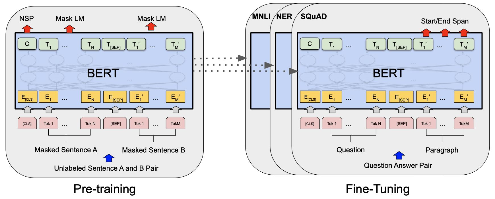

Pre-trained models

1. BERT: Pre-training of Deep Bidirectional Transformers for Language Understanding (Devlin et al., 2019)[[paper]](https://arxiv.org/pdf/1810.04805.pdf) [[github]](https://github.com/huggingface/transformers)

    
    <em>BERT (Devlin et al., 2019)</em>

